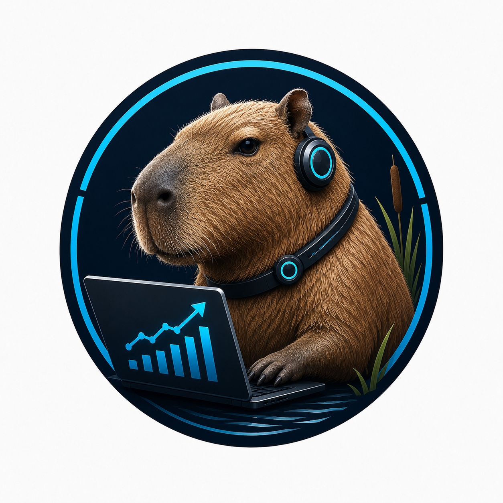

<p align="center">
  
</p>

<h1 align="center">cap-evolve</h1>

<p align="center"><em>watch capability evolve</em></p>

<p align="center">
  
  
  
  
  
</p>

**cap-evolve is a skills-based, host-agnostic harness that optimizes *any* agent
capability — a system prompt, its tools/MCP, or a whole skill package — against
*your* eval, with honesty enforced in code and every iteration git-versioned.**

You wire a tiny adapter once (or let a coding agent write it for you). cap-evolve
runs the loop: evaluate → diagnose failures → propose an edit → keep it only if it
beats a held-out split by a significant margin → commit → report a single honest
number. It optimizes what your agent *reads*, not its weights.

**Contents:** [Why](#why-cap-evolve) · [Install](#install) ·
[Toy example](#toy-example-zero-api) · [tau2-bench example](#tau2-bench-example-real) ·
[Optimize your own](#optimize-your-own) · [How it works](#how-it-works) ·
[Comparison](#how-it-compares) · [Skill library](#skill-library) ·
[Results](#results) · [License](#license)

## Why cap-evolve

- **Optimizes prompts, tools/MCP, *and* skill packages** — not just prompts.
  Pick one or several (`[system-prompt, tools, mcp-tool, skill-package]`) and
  optimize them jointly.
- **Onboard any benchmark/agent from a single prompt.** Paste one intake brief to
  your coding agent; it installs the benchmark, wires a tiny adapter, and runs the
  loop. No pre-integration.
- **Honesty enforced in code, not docs.** The sealed test split is scored exactly
  once and a paired significance gate (Δ > k·SE) decides every acceptance — both
  live in the `cap_evolve` core, the only place rewards are aggregated.
- **Host- and agent-agnostic.** The optimizer is *any* coding-agent CLI
  (claude-code, codex, gemini, opencode, ibm-bob, …) resolved by one registry row.
  No framework lock-in.
- **Git-versioned iterations + optimizer memory** — every candidate is a commit;
  rejected approaches are remembered and never re-proposed.
- **Per-iteration optimizer $ budget**, enforced by the optimizer CLI itself
  (e.g. claude `--max-budget-usd`), plus hard total caps and a dry-run estimate.
- **Live dashboard** — per-iteration optimizer & runner cost + time, intake cost,
  lineage tree, per-iteration diffs, and a tasks × iterations pass/fail heatmap.
- **Skills-native & trivially extensible** — a new capability, algorithm, or
  optimizer is one folder or one registry row.
- **Zero runtime dependencies** — the core is pure Python stdlib.

## Install

Requires **Python 3.10+** and **git**.

```bash
git clone <repo> cap-evolve && cd cap-evolve
pip install ./core            # the honest-eval core (package: cap-evolve-core, CLI: cap-evolve)
./install.sh                  # optional: copy skills into your agent host's skills dir
```

> If your default pip index requires auth, use
> `pip install ./core --index-url https://pypi.org/simple`.

Optimizing a real agent additionally needs a coding-agent CLI to act as the
optimizer (e.g. `claude`, `codex`, `gemini`) and any model credentials in a
repo-root `.env`. The toy example below needs **neither**.

## Toy example (zero-API)

Verify the install with a deterministic, no-key run. `toy_calc` is a stand-in
agent that only answers correctly when its system prompt contains a `[CALC]`
marker; the `mock` optimizer adds it, so the score provably rises — no model is
called.

```bash
bash examples/toy_calc/run.sh
```

Expected: the seed prompt scores `0.0` on val; the optimized prompt is gate-accepted
and scores `1.0` on the sealed test split.

```text
baseline_val 0.0  ->  test_reward 1.0   (gate-accepted, test sealed) + dashboard.html
```

This is exactly what `core/tests/test_e2e_slice.py` asserts. Open the printed
`dashboard.html` in any browser to see the run.

## tau2-bench example (real)

The bundled [`examples/tau2_airline`](examples/tau2_airline) takes a **brand-new
benchmark** from one prompt to an honest, optimized result. It optimizes the
airline **policy + tools together** with a `claude-opus-4-6` optimizer, using
`gpt-oss-120b` over IBM RITS as **both** the agent and the user simulator.

```bash
# RITS creds in repo-root .env (RITS_API_KEY, RITS_API_URL); be logged into Claude Code.
bash examples/tau2_airline/setup.sh   # intake: clone + pip install -e tau2-bench, scaffold
                                      # the project, wire adapter + RITS shim + seed,
                                      # then cap-evolve check (the hard gate)
bash examples/tau2_airline/run.sh     # cap-evolve run --dashboard auto: full loop + live UI
```

This two-command path is simply the executable transcript of pasting
[`PROMPT.md`](examples/tau2_airline/PROMPT.md) to your coding agent and saying
*"follow [`RUN.md`](RUN.md)."* Intake onboards tau2-bench (recording the resolved
commit), wires the adapter, passes `cap-evolve check`, then optimizes over all 50
airline tasks (10 trials each) under a per-iteration `--max-budget-usd` cap, with a
paired significance gate and a git commit per iteration. `--dashboard auto` serves
the live capybara UI; the `setup.sh` flag `--dashboard` / `--no-dashboard` toggles
installing that server. Full walkthrough: [`DEMO.md`](examples/tau2_airline/DEMO.md);
reproduce from zero: [`docs/REPRODUCE_tau2.md`](docs/REPRODUCE_tau2.md).

## Optimize your own

To optimize **your** capability against **your** benchmark, you wire one small
**adapter** ([`docs/ADAPTER_CONTRACT.md`](docs/ADAPTER_CONTRACT.md)) — three
required methods plus optional hooks:

```python
tasks(split)                   -> list[Task]   # your eval cases for 'train'|'val'|'test'|'all'
run_target(task, ctx, *, seed) -> Rollout      # run your agent with the candidate LIVE as ctx;
                                               #   forward `seed` if stochastic; set Rollout.error on infra failure
score(task, rollout)           -> Score        # reward in [0,1] + feedback (never leak the gold)

# optional (working defaults provided):
materialize(cand_dir, edits)   -> None         # PURE write of edits into cand_dir
live(cand_dir)                 -> ctx (CM)      # make the candidate live for ONE eval
run_batch(tasks, ctx, *, seed) -> ...           # implement INSTEAD of run_target to drive a
                                               #   benchmark's OWN batch runner (as tau2 does)
```

Everything else — splits, trials, gating, pass^k, the sealed test, memory, and the
dashboard — is provided by the core and must not be reimplemented (that is what
keeps eval honest). Two ways to get there:

**A — let your coding agent build it (no Python from you).** Open the coding agent
you already use at the repo root and tell it to follow `RUN.md`. It loads the
`intake` skill, asks for anything missing (never fabricating a NEEDED input),
writes the adapter, runs `cap-evolve check`, then the full loop. Give it the brief
intake needs: capability type(s), benchmark repo + install, runner model +
credentials, scorer, optimizer + model, budget, and gate.
[`examples/tau2_airline/PROMPT.md`](examples/tau2_airline/PROMPT.md) is a complete
worked brief.

**B — drive the `cap-evolve` CLI yourself.**

```bash
python3 skills/phases/intake/scripts/run.py --base .capevolve   # scaffold adapter STUB + capevolve.yaml
# 1. implement tasks / run_target (or run_batch) / score in
#    .capevolve/project/adapters/adapter.py  (copy the closest example below)
# 2. set capabilities / optimizer / algorithm / splits in capevolve.yaml
cap-evolve check .capevolve/project                              # hard gate — must print {"ok": true}
cap-evolve estimate --spec .capevolve/project/capevolve.yaml     # dry-run cost preview (spends nothing)
cap-evolve run   --spec .capevolve/project/capevolve.yaml --project .capevolve/project
open .capevolve/run_*/dashboard.html
```

Start from the closest example and edit its `adapter.py`:

| You want to optimize…                       | Copy                                              | `capabilities:`          |
|---------------------------------------------|---------------------------------------------------|--------------------------|
| a **prompt** (zero-API proof)               | [`examples/toy_calc`](examples/toy_calc)          | `[system-prompt]`        |
| a **system prompt + tools** (real agent)    | [`examples/tau2_airline`](examples/tau2_airline)  | `[system-prompt, tools]` |

**Swapping the optimizer is one word** in `capevolve.yaml` — one runner
(`run-optimizer`) resolves the name via `skills/optimizers/registry.yaml`:

```yaml
capabilities:    [system-prompt, tools]   # any of: system-prompt | tools | mcp-tool | skill-package
optimizer_skill: claude-code              # ← swap: codex | gemini-cli | opencode | openclaw | ibm-bob | generic | mock
algorithm_skill: hill-climb               # hill-climb (--focus all|cyclic|hardest-first) | gepa | skillopt
num_trials: 4
store: git                                # versions every iteration
```

**Extending is just as small:** a new capability, algorithm, or optimizer is one
folder or one `optimizers/registry.yaml` row — see
[`docs/EXTENDING.md`](docs/EXTENDING.md).

## How it works

**intake → implement-and-check → baseline → optimize → finalize → report.**

Intake collects inputs and scaffolds the project. Implement-and-check is a hard
gate: `cap-evolve check` refuses to proceed until the adapter is real and
deterministic. Baseline freezes a seeded train/val/test split (test **sealed**) and
scores the seed on val. Each optimize iteration **diagnoses** failing val traces →
the optimizer **proposes** one edit → the candidate is **evaluated** on val (each
trial gets its own seed, so pass^k measures real variance) → a **paired
significance gate** (Δ > k·SE) accepts or rejects → the iteration is committed and
memory updated. Finalize scores the best candidate on the **sealed test split
exactly once**; report writes `report.md` and a self-contained `dashboard.html`.

> **Honesty is enforced in code, not docs.** Splitting, reward aggregation, the
> gate, and sealing test all live in `cap_evolve`
> ([`docs/HONEST_EVAL.md`](docs/HONEST_EVAL.md)). Infra-vs-capability failures are
> distinguished by a structured `Rollout.error` signal, never by string-matching
> feedback prose.

## How it compares

| | cap-evolve | DSPy | GEPA | promptfoo |
|---|:--:|:--:|:--:|:--:|
| Optimizes prompts | ✅ | ✅ | ✅ | ❌ (eval only) |
| Optimizes tools/MCP + skill packages | ✅ | ➖ | ➖ | ❌ |
| Sealed test + significance gate enforced in code | ✅ | ➖ | ➖ | ➖ |
| Host- & agent-agnostic (no framework lock-in) | ✅ | ❌ | ❌ | ➖ |
| Onboard a benchmark from a single prompt | ✅ | ❌ | ❌ | ➖ |
| Git-versioned iterations + optimizer memory | ✅ | ❌ | ❌ | ❌ |
| Live cost-aware dashboard | ✅ | ❌ | ❌ | ➖ |
| Zero runtime dependencies | ✅ | ❌ | ❌ | ❌ |

Roadmap: [`docs/ROADMAP.md`](docs/ROADMAP.md).

## Skill library

cap-evolve is a library of **18** [Agent Skills](https://www.anthropic.com/news/skills)
over a tiny stdlib core. The 8 per-CLI optimizers collapsed into one
`run-optimizer` skill + a one-row-per-optimizer registry; the three hill-climb
variants collapsed into one `hill-climb` skill with `--focus`.

| Component | Skills |
|-----------|--------|
| orchestrate  | `orchestrate` · `using-cap-evolve` (session-start router) |
| phases       | `intake` · `implement-and-check` · `baseline` · `evaluate` · `diagnose` · `gate` · `finalize` · `report` |
| capabilities | `system-prompt` · `skill-package` · `tools` · `mcp-tool` |
| algorithms   | `hill-climb` (`--focus all\|cyclic\|hardest-first`) · `gepa` · `skillopt` |
| optimizers   | `run-optimizer` + `optimizers/registry.yaml` (`claude-code`, `codex`, `gemini-cli`, `opencode`, `openclaw`, `ibm-bob`, `generic`, `mock`) |

`gepa` (real GEPA — reflective Pareto search, two-stage minibatch-then-full-val
economy; arXiv:2507.19457) and `skillopt` (epochs × mini-batches with a decaying
textual learning rate; arXiv:2605.23904) are the sample-efficient **flagships**;
`hill-climb` is the simple global-best baseline climber.

**Claude Code plugin:** `claude --plugin-dir ./plugins/cap-evolve` exposes every
skill as `/cap-evolve:<skill>` and arms honesty **hooks** (PreToolUse denies edits
to the sealed test/gold; Stop/SubagentStop block finishing until `cap-evolve check`
and the gate are green) — all in **core-owned scripts**, never in editable skill
markdown.

## Results

<!-- RESULTS: filled from examples/tau2_airline/run_full -->

> Real [tau2-bench](https://github.com/sierra-research/tau2-bench) airline run —
> optimizing the airline policy + tools with a `claude-opus-4-6` optimizer and
> `gpt-oss-120b` (agent + user simulator, via IBM RITS) over all 50 tasks. Numbers
> come from the latest run in
> [`examples/tau2_airline/run_full/`](examples/tau2_airline/run_full/) (`report.md` /
> `dashboard.html`); every iteration is a git commit. Reproduce from zero:
> [`docs/REPRODUCE_tau2.md`](docs/REPRODUCE_tau2.md).

## Contributing

See [CONTRIBUTING.md](CONTRIBUTING.md) and the [Code of Conduct](CODE_OF_CONDUCT.md).
Report security issues via [SECURITY.md](SECURITY.md). Changes: [CHANGELOG.md](CHANGELOG.md).

## Citation

```bibtex
@software{cap-evolve,
  title  = {cap-evolve: a skills-native, host-agnostic harness for honestly
            optimizing AI-agent capabilities},
  year   = {2026},
  note   = {https://github.com/skillberry-ai/cap-evolve}
}
```

**Acknowledgements.** The `gepa` and `skillopt` skills are independent
implementations of the GEPA (arXiv:2507.19457) and SkillOpt (arXiv:2605.23904)
papers — no third-party code is included; both reference projects are MIT-licensed.
cap-evolve also draws on ideas from DSPy, tau-bench/tau2-bench, and the Agent Skills
standard. Full citations: [docs/sources.bib](docs/sources.bib).

## License

MIT.
